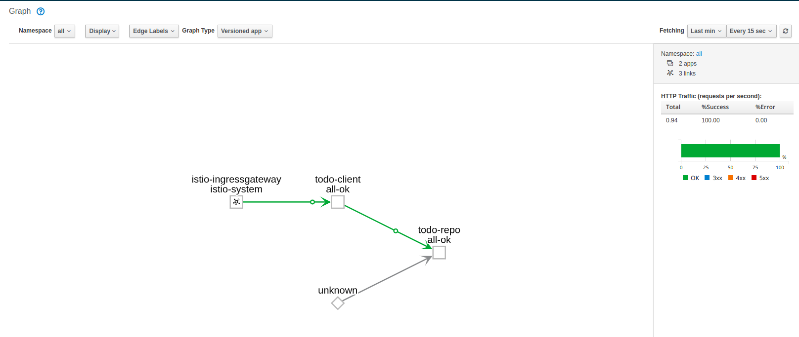
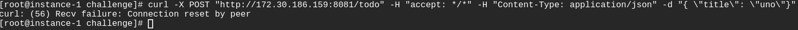
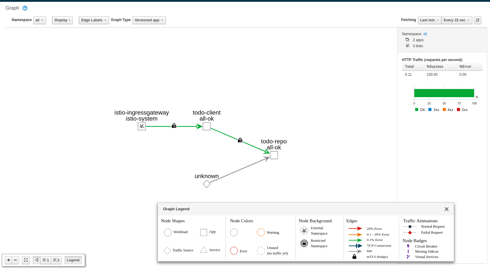

Antes de aplicar cambios en la política de seguridad, el funcionamiento por defecto sin aplicar ajustes de seguridad es permitir tráfico entre servicios




Para trabajar con las capacidades en el ámbito de seguridad que nos proporciona Istio, debemos asegurarnos de que en la política por defecto está habilitada "mutual TLS".
```
oc apply -f default-meshpolicy-tls.yaml
```

Hay que incluir el bloque `TrafficPolicy` en los recursos `DestinationRule` y aplicar cambios:

```
oc apply -f networking.yaml
```

Istio instala automáticamente los certificados necesarios para la autenticación mTLS en todos los 'sidecars containers'. Para confirmar que los certificados existen en los 'sidecars' hay que ejecutar lo siguiente:

```
# oc exec $(oc get pod -l app=todo-repo -o jsonpath={.items..metadata.name}) -c istio-proxy -- ls /etc/certs
cert-chain.pem
key.pem
root-cert.pem
```

Para verificar el funcionamiento comprobando que la configuración TLS es consistente entre los diferentes microservicios, el status debe aparecer `OK` en los diferentes servicios:

```
[root@instance-1 ~]# istioctl authn tls-check todo-repo.default.svc.cluster.local
Stderr when execute [/usr/local/bin/pilot-discovery request GET /debug/authenticationz ]: gc 1 @0.024s 18%: 4.3+3.6+1.6 ms clock, 8.6+0.37/0.69/1.2+3.2 ms cpu, 4->4->2 MB, 5 MB goal, 2 P
gc 2 @0.047s 17%: 0.95+21+3.7 ms clock, 1.9+0.23/2.7/0.15+7.5 ms cpu, 4->4->2 MB, 5 MB goal, 2 P

HOST:PORT                                    STATUS     SERVER     CLIENT     AUTHN POLICY     DESTINATION RULE
todo-repo.default.svc.cluster.local:8081     OK         mTLS       mTLS       default/         todo-repo/default
```


Para comprobar que las peticiones en texto plano fallan hay que saltarse los proxies, es posible realizar un test ejecutando el siguiente comando en un 'sidecar-proxy' para ver el código de respuesta:



```
[root@instance-1 ~]# oc exec $(oc get pod -l app=todo-repo -o jsonpath={.items..metadata.name}) -c istio-proxy -- curl http://todo-repo:8081 -o /dev/null -s -w '%{http_code}\n'
000
command terminated with exit code 56
```

Una vez aplicada la política por defecto para activar mTLS y añadirle configuración a las `DestinationRule`, el tráfico aparece securizado en nuestra herramienta de observabilidad Kiali:


