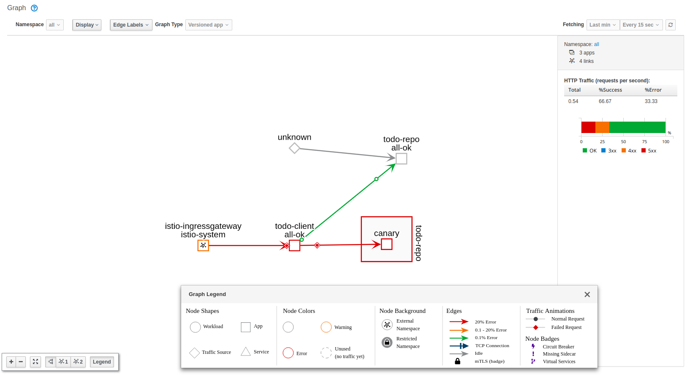

Se pueden aplicar diferentes políticas de acceso en base a determinados atributos, como pueden ser origen y/o destino.

En este caso hay dos versiones desplegadas de la misma aplicación y vamos a denegar el tráfico hacia una de ellas debido a un bug:

Para desplegar la nueva versión de la app:

```
oc apply -f todo-repo-canary.yaml
```

Posteriormente, los recursos necesarios de Istio:
```
oc apply -f canary-istio.yaml
```

Para aplicar la regla que deniga el tráfico en función de determinados atributos, en este caso se ha llevado a cabo utilizando las etiquetas para trabajar con origen y destino:

```
oc apply -f denier.yaml
```


En la siguiente imagen se aprecia que la versión 'canary' está aislada y el tráfico hacia ella es denegado mientras el tráfico hacia la otra versión es permitido:


